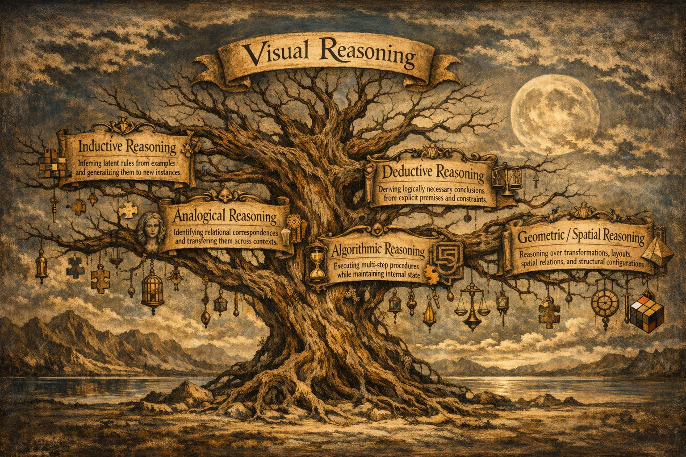

# Awesome Visual Puzzles

Project page for paper:

**Reasoning or Pattern Matching? Probing Large Vision-Language Models with Visual Puzzles**

## Contents
- [Overview](#overview)
- [What is a visual puzzle?](#what-is-a-visual-puzzle)
- [Taxonomy](#taxonomy)
  - [Inductive Reasoning](#inductive-reasoning)
  - [Analogical Reasoning](#analogical-reasoning)
  - [Algorithmic Reasoning](#algorithmic-reasoning)
  - [Deductive Reasoning](#deductive-reasoning)
  - [Geometric / Spatial Reasoning](#geometric--spatial-reasoning)
- [Cross-cutting Failure Modes](#cross-cutting-failure-modes)
- [Future Directions](#future-directions)
- [Paper](#paper)
- [Citation](#citation)
- [Contributing](#contributing)

## Overview

Large Vision-Language Models often appear impressive on multimodal tasks, but it remains unclear whether they truly **reason over visual structure** or rely on **shortcut-driven pattern matching**.

Visual puzzles provide a particularly useful testbed because they are:
- **visually grounded**
- **constrained and verifiable**
- **less reliant on external world knowledge**
- **well-suited for probing abstraction, rule induction, analogy, planning, deduction, and spatial reasoning**

This repository organizes the literature on visual puzzle reasoning in LVLMs and highlights recurring failure modes across benchmark families.

---

## What is a visual puzzle?

In the survey’s framing, a visual puzzle is a reasoning-centered task with three core properties:

1. **Essential reliance on visual information**
2. **An explicitly constrained and verifiable structure**
3. **A focus on reasoning rather than knowledge priors**

A visual puzzle can be viewed as a problem instance **⟨I, R, S⟩**, where:
- **I** = input (visual input, optionally with text)
- **R** = rules or constraints, either explicit or implicit
- **S** = structured solution space, usually discrete or combinatorial, with verifiable correctness

---

## Taxonomy

---

## Inductive Reasoning

### Focus
Benchmarks in this category test whether LVLMs can infer hidden rules from visual examples rather than match familiar surface patterns.

### Representative benchmark families
- **RPM / PGM-style abstraction**
- **ARC / EasyARC / ARC-AGI-2**
- **BabyVision**
- **VisualPuzzles**
- **VisuRiddles**
- **MME-Reasoning**
- **PuzzleVQA**
- **VisualSphinx**
- **LogicVista**
- **I-RAVEN / A-I-RAVEN / I-RAVEN-Mesh**
- **IQBench**
- **MANBench**

### Main observations
- performance is brittle under distribution shift
- models often rely on superficial cues instead of invariant rules
- perceptual limitations and reasoning errors are deeply entangled
- fluent verbalizations do not guarantee faithful induction

### Papers

#### Foundations
- **Raven Progressive Matrices** — John Raven and Jean Raven. *Handbook of Nonverbal Assessment*, 2003.  
  Canonical matrix-completion paradigm for abstract visual pattern induction over attributes such as shape, size, and color.

- **Measuring Abstract Reasoning in Neural Networks** — David Barrett, Felix Hill, et al. *ICML*, 2018.  
  Introduces Procedurally Generated Matrices (PGM), a controlled benchmark for testing rule induction and compositional abstract reasoning.

- **On the Measure of Intelligence** — François Chollet. *arXiv*, 2019.  
  Introduces ARC, a grid-based induction benchmark where models must infer latent rules from few input-output examples and generalize to new instances.

#### Foundational LVLM Benchmarks
- **EasyARC: Evaluating Vision Language Models on True Visual Reasoning** — Mert Unsal and Aylin Akkus. *arXiv*, 2025.  
  Simplifies visual input to reduce perceptual confounds and better isolate inductive reasoning in ARC-style tasks.

- **ARC-AGI-2: A New Challenge for Frontier AI Reasoning Systems** — François Chollet, Mike Knoop, et al. *arXiv*, 2025.  
  Raises the difficulty of ARC-style reasoning with stronger demands on deliberate thinking and compositional generalization.

- **BabyVision: Visual Reasoning Beyond Language** — Liang Chen, Weichu Xie, et al. *arXiv*, 2026.  
  Probes the developmental roots of induction with early-vision-style tasks, exposing failures even on simple structure-learning problems.

#### Knowledge-Decoupled Probes
- **VisualPuzzles: Decoupling Multimodal Reasoning Evaluation from Domain Knowledge** — Yueqi Song, Tianyue Ou, et al. *arXiv*, 2025.  
  A representative benchmark for testing inductive reasoning while minimizing reliance on world knowledge and linguistic priors.

- **VisuRiddles: Fine-Grained Perception Is a Primary Bottleneck for Multimodal Large Language Models in Abstract Visual Reasoning** — Hao Yan, Handong Zheng, et al. *arXiv*, 2025.  
  Examines induction under fine-grained perceptual demands, highlighting perception as a key bottleneck for abstract rule inference.

- **MME-Reasoning: A Comprehensive Benchmark for Logical Reasoning in MLLMs** — Jiakang Yuan, Tianshuo Peng, et al. *arXiv*, 2025.  
  Reduces perceptual burden and knowledge dependence to better isolate the reasoning component of LVLM performance.

- **PuzzleVQA: Diagnosing Multimodal Reasoning Challenges of Language Models with Abstract Visual Patterns** — Yew Ken Chia, Vernon Toh, et al. *ACL Findings*, 2024.  
  Frames visual puzzle solving as VQA, emphasizing simplicity, diversity, and rationale-based auditing of inferred rules.

- **VisualSphinx: Large-Scale Synthetic Vision Logic Puzzles for RL** — Yichen Feng, Zhangchen Xu, et al. *arXiv*, 2025.  
  Uses large-scale synthetic puzzle data to study whether inductive abilities can be strengthened through training.

- **LogicVista: Multimodal LLM Logical Reasoning Benchmark in Visual Contexts** — Yijia Xiao, Edward Sun, et al. *arXiv*, 2024.  
  A hybrid benchmark that sometimes provides hints, shifting the focus from pure rule discovery to rule grounding and execution.

#### Generalization Probes
- **Stratified Rule-Aware Network for Abstract Visual Reasoning** — Sheng Hu, Yuqing Ma, et al. *AAAI*, 2021.  
  Introduces I-RAVEN, a rule-annotated Raven-style benchmark used to test whether induced abstractions transfer beyond the training distribution.

- **A-I-RAVEN and I-RAVEN-Mesh: Two New Benchmarks for Abstract Visual Reasoning** — Mikołaj Małkiński and Jacek Mandziuk. *IJCAI*, 2025.  
  Extends Raven-style evaluation to unseen configurations, attributes, and visual renderings, stressing transfer and compositionality.

#### Human-Based Intelligence
- **IQBench: How “Smart” Are Vision-Language Models? A Study with Human IQ Tests** — Tan-Hanh Pham, Phu-Vinh Nguyen, et al. *arXiv*, 2025.  
  Uses IQ-style visual artifacts to evaluate inductive reasoning, intermediate explanations, and alignment with human problem-solving.

- **MANBench: Is Your Multimodal Model Smarter than Human?** — Han Zhou, Qitong Xu, et al. *ACL Findings*, 2025.  
  Tests inductive reasoning with maze-like and shape-based tasks, contrasting genuine abstraction with superficial pattern matching.

---

## Analogical Reasoning

### Focus
These benchmarks test whether LVLMs can identify **relational structure**, not just recognize individual objects or symbols.

### Representative benchmark families
- **Bongard Problems**
- **Bongard-HOI**
- **Bongard-OpenWorld**
- **Bongard in Wonderland**
- **Bongard-RWR+**
- **REBUS**
- **COLUMBUS**
- **MARVEL**
- **VisualPuzzles**
- **VOILA**

### Main observations
- LVLMs often over-index on local features like color, texture, or object count
- they struggle to preserve relational alignment even when perception succeeds
- analogy performance degrades under small variations and new contexts
- literal description often replaces genuine relational transfer

### Papers

#### Contrastive Concept Discovery
- **Bongard Problems** — Mikhail M. Bongard. *Pattern Recognition*, 1970.  
  Foundational contrastive visual concept-discovery paradigm: infer the abstract concept separating positive from negative image sets.  

- **Bongard-HOI: Benchmarking Few-Shot Visual Reasoning for Human-Object Interactions** — Huaizu Jiang, Xiaojian Ma, et al. *CVPR*, 2022.  
  Extends Bongard-style reasoning to natural images with human-object interactions, probing relational perception beyond synthetic primitives.  

- **Bongard-OpenWorld: Few-Shot Reasoning for Free-Form Visual Concepts in the Real World** — Rujie Wu, Xiaojian Ma, et al. *ICLR*, 2024.  
  Relaxes closed-world assumptions by introducing open-vocabulary visual concepts in real-world settings.  

- **Bongard in Wonderland: Visual Puzzles That Still Make AI Go Mad?** — Antonia Wüst, Tim Tobiasch, et al. *ICML*, 2025.  
  Revisits classic Bongard-style abstraction with visually simple but diagnostically precise concept distinctions.  

- **Bongard-RWR+: Real-World Representations of Fine-Grained Concepts in Bongard Problems** — Szymon Pawlonka, Mikołaj Małkiński, and Jacek Mandziuk. *arXiv*, 2025.  
  Grounds fine-grained Bongard concepts in real-world imagery, enabling comparison between synthetic and natural visual formulations.  

#### Relational and Structural Mapping
- **REBUS: A Robust Evaluation Benchmark of Understanding Symbols** — Andrew Gritsevskiy, Arjun Panickssery, et al. *arXiv*, 2024.  
  Tests whether LVLMs can move beyond literal symbol recognition and perform relational mapping from visual wordplay to language.  

- **COLUMBUS: Evaluating Cognitive Lateral Understanding Through Multiple-Choice Rebuses** — Koen Kraaijveld, Yifan Jiang, et al. *arXiv*, 2024.  
  Evaluates analogical mapping and lateral interpretation in rebus-style multiple-choice settings.  

- **MARVEL: Multidimensional Abstraction and Reasoning through Visual Evaluation and Learning** — Yifan Jiang, Jiarui Zhang, et al. *NeurIPS*, 2024.  
  Uses geometric and abstract shapes to test whether models can preserve relational alignment, separating representation from analogy mapping.  

- **VisualPuzzles: Decoupling Multimodal Reasoning Evaluation from Domain Knowledge** — Yueqi Song, Tianyue Ou, et al. *arXiv*, 2025.  
  Includes knowledge-light analogy tasks of varying difficulty, exposing failures in structural mapping rather than world-knowledge recall.  

- **VOILA: Evaluation of MLLMs for Perceptual Understanding and Analogical Reasoning** — Nilay Yilmaz, Maitreya Patel, et al. *ICLR*, 2025.  
  Couples analogical reasoning with heavier perceptual demands, testing transfer across explicit visual analogy instances.  

#### Analysis-Linked Rebus Evidence
- **A Large and Diverse Multimodal Benchmark for Evaluating the Ability of Vision-Language Models to Understand Rebus Puzzles** — Trishanu Das, Abhilash Nandy, et al. *arXiv*, 2025.  
  Provides additional evidence that LVLMs often default to literal symbolic descriptions instead of the relational mapping needed for rebus solving.

---

## Algorithmic Reasoning

### Focus
These tasks probe whether models can follow procedures, maintain evolving state, and execute multi-step reasoning over time.

### Representative benchmark families
- **PUZZLES**
- **AlgoPuzzleVQA**
- **VisualPuzzles (algorithmic instances)**
- **Jigsaw-Puzzles**
- **LEGO-Puzzles**
- **PuzzleBench**
- **ING-VP**
- **BALROG**
- **PuzzlePlex**
- **ENIGMAEVAL**

### Main observations
- strong degradation with increasing procedural depth
- failures often arise from weak state tracking rather than missing instructions
- multi-step interaction exposes a sharp **perception-execution gap**
- chain-of-thought-style explanations can remain plausible while execution fails

### Papers

#### Static Symbolic Puzzles
- **PUZZLES: A Benchmark for Neural Algorithmic Reasoning** — Benjamin Estermann, Luca A. Lanzendörfer, et al. *NeurIPS*, 2024.  
  Programmatically generated puzzles with varying size and difficulty, designed to test generalization in algorithmic execution over a well-defined action space.

- **AlgoPuzzleVQA: Diagnosing Multimodal Reasoning Challenges of Language Models with Algorithmic Multimodal Puzzles** — Deepanway Ghosal, Vernon Toh, et al. *NAACL*, 2025.  
  Grid-based puzzles in a VQA format that probe action optimization, combinatorics, search logic, multimodal arithmetic, and graph reasoning.

- **VisualPuzzles: Decoupling Multimodal Reasoning Evaluation from Domain Knowledge** — Yueqi Song, Tianyue Ou, et al. *arXiv*, 2025.  
  Its algorithmic instances emphasize procedural execution, including perceptual constraint satisfaction, combinatorics, and multimodal arithmetic.

#### Spatially Procedural Puzzles
- **Jigsaw-Puzzles: From Seeing to Understanding to Reasoning in Vision-Language Models** — Zesen Lyu, Dandan Zhang, et al. *arXiv*, 2025.  
  Evaluates procedural reasoning through multi-step spatial manipulation, requiring coherent state updates across assembly steps.

- **LEGO-Puzzles: How Good Are MLLMs at Multi-Step Spatial Reasoning?** — Kexian Tang, Junyao Gao, et al. *arXiv*, 2025.  
  Tests whether models can maintain accumulating spatial representations under physical and geometric constraints during multi-step construction.

#### Interactive Planning
- **PuzzleBench: A Fully Dynamic Evaluation Framework for Large Multimodal Models on Puzzle Solving** — Zeyu Zhang, Zijian Chen, et al. *arXiv*, 2025.  
  Introduces an interactive environment where LVLMs must choose sequential actions and preserve verifiable intermediate states.

- **ING-VP: MLLMs Cannot Play Easy Vision-Based Games Yet** — Haoran Zhang, Hangyu Guo, et al. *arXiv*, 2024.  
  Uses simple minimally interactive games to separate perceptual understanding from action implementation and planning.

- **BALROG: Benchmarking Agentic LLM and VLM Reasoning on Games** — Davide Paglieri, Bartłomiej Cupiał, et al. *ICLR*, 2025.  
  Frames reasoning as acting in a dynamic environment with delayed rewards, stressing long-horizon agentic interaction.

- **PuzzlePlex: Benchmarking Foundation Models on Reasoning and Planning with Puzzles** — Yitao Long, Yuru Jiang, et al. *arXiv*, 2025.  
  Focuses on multi-stage interactive execution in deterministic and stochastic settings, probing strategic coherence under evolving constraints.

- **ENIGMAEVAL: A Benchmark of Long Multimodal Reasoning Challenges** — Clinton J. Wang, Dean Lee, et al. *arXiv*, 2025.  
  Introduces difficult multimodal challenges with unambiguous solutions to expose the limits of procedural cognition.
---

## Deductive Reasoning

### Focus
These benchmarks test whether LVLMs can apply explicit rules and constraints to visually grounded entities and maintain global consistency.

### Representative benchmark families
- **LogicVista**
- **VisuLogic**
- **VisualSphinx**
- **MME-Reasoning**
- **VisualPuzzles (deductive puzzles)**
- **Sudoku-Bench**
- **VGRP-Bench**
- **PUZZLES**

### Main observations
- visual grounding errors often propagate into logical failure
- models struggle to integrate multiple constraints into a globally consistent solution
- local correctness does not imply global validity
- coherent explanations often do not reflect correct entailment

### Papers

#### Symbolic Constraints
- **LogicVista: Multimodal LLM Logical Reasoning Benchmark in Visual Contexts** — Yijia Xiao, Edward Sun, et al. *arXiv*, 2024.  
  Evaluates deduction over facts extracted from images, requiring models to bind visual entities and relations to symbols that support formal logical execution.

- **VisuLogic: A Benchmark for Evaluating Visual Reasoning in Multi-Modal Large Language Models** — Weiye Xu, Jiahao Wang, et al. *arXiv*, 2025.  
  Emphasizes visually grounded deduction with hard-to-articulate visual instances, testing whether models can reason without leaning on verbal reformulation.

- **VisualSphinx: Large-Scale Synthetic Vision Logic Puzzles for RL** — Yichen Feng, Zhangchen Xu, et al. *arXiv*, 2025.  
  Treats deductive reasoning as a capability that can be strengthened through training on synthetic visual logic puzzles.

- **MME-Reasoning: A Comprehensive Benchmark for Logical Reasoning in MLLMs** — Jiakang Yuan, Tianshuo Peng, et al. *arXiv*, 2025.  
  Reduces perceptual burden and knowledge dependence to more cleanly isolate deductive reasoning ability.

- **VisualPuzzles: Decoupling Multimodal Reasoning Evaluation from Domain Knowledge** — Yueqi Song, Tianyue Ou, et al. *arXiv*, 2025.  
  Its deductive puzzle instances focus on explicit rule application while minimizing reliance on outside knowledge.

#### Grid-Based Constraints
- **Sudoku-Bench: Evaluating Creative Reasoning with Sudoku Variants** — Jeffrey Seely, Yuki Imajuku, et al. *arXiv*, 2025.  
  Tests whether LVLMs can maintain global consistency while making local assignments under explicit Sudoku-style constraints.

- **VGRP-Bench: Visual Grid Reasoning Puzzle Benchmark for Large Vision-Language Models** — Yufan Ren, Konstantinos Tertikas, et al. *arXiv*, 2025.  
  Extends grid-based deduction to diverse rule systems, grid sizes, and decision spaces while disentangling reasoning from visual perception.

- **PUZZLES: A Benchmark for Neural Algorithmic Reasoning** — Benjamin Estermann, Luca A. Lanzendörfer, et al. *NeurIPS*, 2024.  
  Also supports deductive evaluation by testing constraint propagation through multi-step symbolic manipulation in structured grid settings.
---

## Geometric / Spatial Reasoning

### Focus
This category stress-tests spatial grounding, geometric transformations, mental rotation, structural consistency, and spatial state tracking.

### Representative benchmark families
- **A-I-RAVEN**
- **I-RAVEN-Mesh**
- **BabyVision**
- **VisualPuzzles**
- **VisuRiddles**
- **Bongard-style geometric puzzles**
- **VOILA**
- **Jigsaw-Puzzles**
- **LEGO-Puzzles**
- **BALROG**
- **VGRP-Bench**
- **PUZZLES**
- **VisuLogic / LogicVista**
- **GeoSketch**
- **Rubik’s Cube-style tasks**

### Main observations
- models are sensitive to superficial spatial cues
- geometric errors accumulate over multi-step execution
- spatial grounding is often the bottleneck behind apparent deductive failures
- fluent explanations frequently lack spatial fidelity

### Papers

#### Geometric Transformations in Inductive Puzzles
- **A-I-RAVEN and I-RAVEN-Mesh: Two New Benchmarks for Abstract Visual Reasoning** — Mikołaj Małkiński and Jacek Mańdziuk. *IJCAI*, 2025.  
  Extends Raven-style abstract reasoning with stronger geometric attributes, testing whether models can generalize spatial relations beyond surface appearance.

- **BabyVision: Visual Reasoning Beyond Language** — Liang Chen, Weichu Xie, et al. *arXiv*, 2026.  
  Shows that LVLMs struggle even with simple geometric primitives such as rotation and reflection when other basic attributes are present.

- **VisualPuzzles: Decoupling Multimodal Reasoning Evaluation from Domain Knowledge** — Yueqi Song, Tianyue Ou, et al. *arXiv*, 2025.  
  Includes geometry-heavy visual puzzles where success depends on fine-grained spatial perception and generalization across diverse visual forms.

- **VisuRiddles: Fine-Grained Perception Is a Primary Bottleneck for Multimodal Large Language Models in Abstract Visual Reasoning** — Hao Yan, Handong Zheng, et al. *arXiv*, 2025.  
  Highlights how geometric regularities are often missed when perception and spatial abstraction interact.

#### Spatial Structure in Analogical Reasoning
- **Bongard in Wonderland: Visual Puzzles That Still Make AI Go Mad?** — Antonia Wüst, Tim Tobiasch, et al. *ICML*, 2025.  
  Uses Bongard-style visual concepts built around spatial relations such as enclosure, alignment, and symmetry.

- **Bongard-RWR+: Real-World Representations of Fine-Grained Concepts in Bongard Problems** — Szymon Pawlonka, Mikołaj Małkiński, and Jacek Mańdziuk. *arXiv*, 2025.  
  Tests whether models can preserve spatial concept structure in more realistic visual settings.

- **VOILA: Evaluation of MLLMs for Perceptual Understanding and Analogical Reasoning** — Nilay Yilmaz, Maitreya Patel, et al. *ICLR*, 2025.  
  Probes whether models can transfer analogical structure while preserving the spatial relations that define the analogy.

#### Spatial State Tracking in Procedural Tasks
- **Jigsaw-Puzzles: From Seeing to Understanding to Reasoning in Vision-Language Models** — Zesen Lyu, Dandan Zhang, et al. *arXiv*, 2025.  
  Evaluates whether LVLMs can track part configurations and predict spatial transformations across intermediate assembly steps.

- **LEGO-Puzzles: How Good Are MLLMs at Multi-Step Spatial Reasoning?** — Kexian Tang, Junyao Gao, et al. *arXiv*, 2025.  
  Tests multi-step spatial reasoning under construction-style constraints where models must maintain coherent intermediate states.

- **BALROG: Benchmarking Agentic LLM and VLM Reasoning on Games** — Davide Paglieri, Bartłomiej Cupiał, et al. *ICLR*, 2025.  
  Embeds spatial reasoning into long-horizon interaction, where correct action selection depends on stable spatial state tracking.

#### Spatial Grounding in Deductive Constraints
- **VGRP-Bench: Visual Grid Reasoning Puzzle Benchmark for Large Vision-Language Models** — Yufan Ren, Konstantinos Tertikas, et al. *arXiv*, 2025.  
  Uses grid-structured problems where deduction depends on accurate interpretation of spatial configuration and rule propagation.

- **PUZZLES: A Benchmark for Neural Algorithmic Reasoning** — Benjamin Estermann, Luca A. Lanzendörfer, et al. *NeurIPS*, 2024.  
  Supports spatially grounded deduction through structured puzzle layouts that require constraint propagation over visual states.

- **VisuLogic: A Benchmark for Evaluating Visual Reasoning in Multi-Modal Large Language Models** — Weiye Xu, Jiahao Wang, et al. *arXiv*, 2025.  
  Shows that deductive reasoning can fail primarily because of spatial misinterpretation rather than incorrect logical rules.

- **LogicVista: Multimodal LLM Logical Reasoning Benchmark in Visual Contexts** — Yijia Xiao, Edward Sun, et al. *arXiv*, 2024.  
  Requires spatial layouts and diagram structure to be correctly grounded before symbolic logical reasoning can succeed.

#### Geometry-Centric Reasoning Benchmarks
- **GeoSketch: A Neural-Symbolic Approach to Geometric Multimodal Reasoning with Auxiliary Line Construction and Affine Transformation** — Shichao Weng, Zhiqiang Wang, et al. *arXiv*, 2025.  
  Focuses directly on geometric construction and transformation, including rotations, reflections, affine mappings, and auxiliary-line reasoning.

- **Structured Task Solving via Modular Embodied Intelligence: A Case Study on Rubik’s Cube** — Chongshan Fan and Shenghai Yuan. *arXiv*, 2025.  
  Evaluates whether models can decompose complex geometric configurations into modular subproblems and coordinate sequential spatial operations under strict constraints.
---

## Cross-cutting Failure Modes

Across reasoning categories, the literature points to several recurring weaknesses:

- **Perception–reasoning bottleneck**  
  Failure often begins with small perceptual mistakes that later derail reasoning.

- **Shortcut reliance**  
  Models frequently exploit superficial patterns, style cues, or local correlations.

- **Brittle generalization**  
  Performance drops sharply on novel renderings, compositions, or transformed instances.

- **Explanation–execution gap**  
  LVLMs can produce convincing rationales while failing to execute valid reasoning steps.

- **Weak state consistency**  
  Long-horizon tasks expose difficulties in tracking intermediate states and constraints.

---

## Future Directions

### 1. The Illusion of Reasoning
A central concern is that LVLMs may generate fluent intermediate explanations that are **not faithfully grounded** in the visual input or the actual reasoning process.

### 2. Multi-Agent Collaboration
Agentic setups may improve puzzle solving by enabling:
- proposal and verification of alternative hypotheses
- explicit disagreement and checking
- better reasoning trace inspection
- explanation judging and constraint validation

### 3. Revisiting Training Objectives
Current training often rewards next-token fluency rather than:
- state-consistent reasoning
- long-horizon execution
- intermediate-step verification
- counterfactual robustness

### 4. Towards Compositional Generalization
Future benchmarks should better probe:
- compositional depth
- compositional breadth
- controlled variable disentanglement
- abstraction under distribution shift

### 5. Abductive and Lateral Visual Reasoning
A major open gap is visual reasoning under:
- incomplete information
- ambiguous evidence
- competing hypotheses
- hypothesis revision and branch verification

---

## Website
https://marialymperaiou.github.io/awesome-visual-puzzles/

## Paper
[https://arxiv.org/abs/2601.13705]

## Contact
For questions, collaborations, or adding new visual puzzle papers contact: [marialymp@ails.ece.ntua.gr]

## Citation
```bibtex
@misc{lymperaiou2026reasoningpatternmatchingprobing,
      title={Reasoning or Pattern Matching? Probing Large Vision-Language Models with Visual Puzzles}, 
      author={Maria Lymperaiou and Vasileios Karampinis and Giorgos Filandrianos and Angelos Vlachos and Chrysoula Zerva and Athanasios Voulodimos},
      year={2026},
      eprint={2601.13705},
      archivePrefix={arXiv},
      primaryClass={cs.CV},
      url={https://arxiv.org/abs/2601.13705}, 
}
